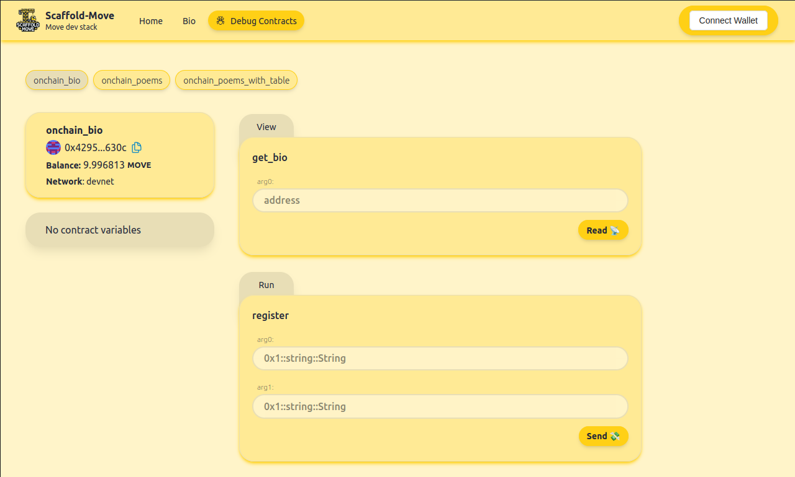

# 🏗 Scaffold-Move

<div align="center">


<h4 align="center">
  <a href="https://github.com/arjanjohan/scaffold-move">Documentation</a> |
  <a href="https://scaffold-move-chi.vercel.app/">Website</a>
</h4>
</div>

🧪 An open-source, up-to-date toolkit for building decentralized applications (dapps) on Move blockchains like Aptos and Movement M1. It's designed to make it easier for developers to create and deploy Move modules and build user interfaces that interact with those modules.

⚙️ Built using NextJS, Tailwind and Typescript.

- ✅ **Module Hot Reload**: Your frontend auto-adapts to your Move modules as you edit it.
- 🪝 **Custom hooks**: Collection of React hooks to simplify interactions with Move modules .
- 🧱 **Components**: Collection of common web3 components to quickly build your frontend.
- 🔐 **Integration with Wallet Providers**: Connect your Petra Wallet and interact with the Aptos or Movement M1 network.



## Requirements

Before you begin, you need to install the following tools:

- [Node (>= v18.17)](https://nodejs.org/en/download/)
- Yarn ([v1](https://classic.yarnpkg.com/en/docs/install/) or [v2+](https://yarnpkg.com/getting-started/install))
- [Git](https://git-scm.com/downloads)
- [Movement CLI](https://aptos.dev/en/build/cli)

## Quickstart

To get started with Scaffold-Move, follow the steps below:

1. Clone this repo & install dependencies

```
git clone https://github.com/arjanjohan/scaffold-move.git
cd scaffold-move
yarn install
```

2. Run a local network in  the first terminal:

```
yarn chain
```

**If you are deploying to devnet or testnet, you can skip this step.**

3. On a second terminal, initialize a new account.

```
yarn account
```

This command overwrites `packages/move/.aptos/config.yaml` with a new Aptos account. The new address is copied over to the first address in the Move.toml file. If no address exists in this file, it is added on a new line.

4. Deploy the test modules:

```
yarn deploy
```

This command deploys the move modules to the selected network. The modules are located in `packages/move/sources` and can be modified to suit your needs. The `yarn deploy` command uses `aptos move publish` to publish the modules to the network. After this is executes the script located in `scripts/loadContracts.js` to make the new modules available in the nextjs frontend.

5. On a third terminal, start your NextJS app:

```
yarn start
```

Visit your app on: `http://localhost:3000`. You can interact with your Move modules using the `Debug Modules` page. You can tweak the app config in `packages/nextjs/scaffold.config.ts`.

**What's next**:

- Edit your Move module `OnchainBio.move` in `packages/move/sources`
- Edit your frontend homepage at `packages/nextjs/app/page.tsx`. For guidance on [routing](https://nextjs.org/docs/app/building-your-application/routing/defining-routes) and configuring [pages/layouts](https://nextjs.org/docs/app/building-your-application/routing/pages-and-layouts) checkout the Next.js documentation.
<!-- - Edit your Move modules test in: `packages/hardhat/test`. To run test use `yarn hardhat:test` -->

## Hooks
Scaffold Move includes custom hooks to make developing a Move dApp easier.

### useDeployedContractInfo
Use this hook to fetch details about a deployed Move module, including the ABI and address.
```
const { data: deployedContractData, isLoading: deployedContractLoading } = useDeployedContractInfo(contractName);

```
This example retrieves the details of the deployed contract with the specified name and stores the details in the deployedContractData object.


#### Parameters
| Parameter	| Type | Description |
| --------- | ---- | ----------- |
| contractName | string | Name of the contract. |

#### Return Value

`data`: Object containing `address` and `abi` of contract.

### useGetAccountMoveBalance
Use this hook to fetch the MOVE balance for an addres.
```
const balance = useGetAccountMoveBalance(address);
```

This example retrieves Move balance of the address  and stores the details in the balance object.

#### Parameters
| Parameter	| Type | Description |
| --------- | ---- | ----------- |
| address | string | Address of the account. |

#### Return Value

`balance`: Object containing Move balance for this address.


### useGetAccountModules

Use this hook to fetch the MOVE modules that are publish on an addres.
```
const { data: accountModules, isLoading: accountModulesLoading } = useGetAccountModules(address);
```

This example fetches all modules that are published on this address.

#### Parameters
| Parameter	| Type | Description |
| --------- | ---- | ----------- |
| address | string | Address of the account. |

#### Return Value

`moveModuleBytecode`: A list of `MoveModuleBytecode` objects.

### useGetAccountResources

Use this hook to fetch the resources that are available on an addres.
```
const { data: accountResources, isLoading: accountResourcesLoading } = useGetAccountResources(address);
```

This example fetches all resources that are on this address.

#### Parameters
| Parameter	| Type | Description |
| --------- | ---- | ----------- |
| address | string | Address of the account. |
| options.retry | number \| boolean | Number of retries, or bool `true` for a single retry  |

#### Return Value

`moveResources`: A list of [`MoveResource`](https://aptos.dev/en/network/blockchain/resources) objects.


### useSubmitTransaction
### useTargetNetwork

## Next steps

For this hackathon I kept the scope small due to the time constraints. I build the most essential and useful features, so that developers can start using Scaffold Move right away. However, there are more features that I want to add to this project after the hackathon. If you have any ideas or suggestions, please reach out to me!

- Debug page
  - Styling Resources tab
  - Fix Vercel bug with Resources tab (Resources only showing on local for now)
  - Group modules under address
- Fix colors for dark mode
- Ensure export default deployedModules satisfies GenericContractsDeclaration
- Add block explorer page
- Add indexer and update testnet config

## Links

- [Demo video](https://www.loom.com/share/4491aa1f222e409782a5ede3a7ac5cb0)
- [Website](https://scaffold-move-chi.vercel.app/)
- [Dorahacks](https://dorahacks.io/buidl/13953)
- [Github](https://github.com/arjanjohan/scaffold-move)

## Deployments
- [Movement testnet](https://explorer.movementnetwork.xyz/account/0xbe119e3724a7aa44ec3716f070fc36f0603937dcdb06e8277a987a87ade39018/modules/code/onchain_bio?network=testnet)

## Team

- [arjanjohan](https://x.com/arjanjohan/)
